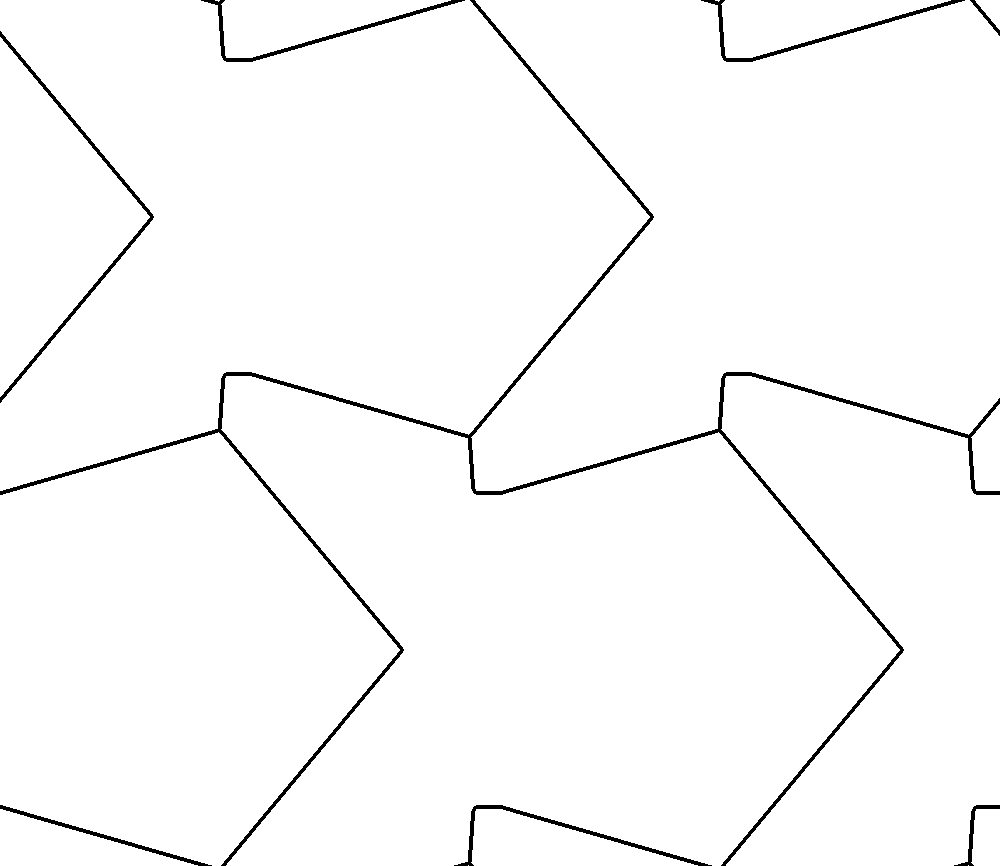
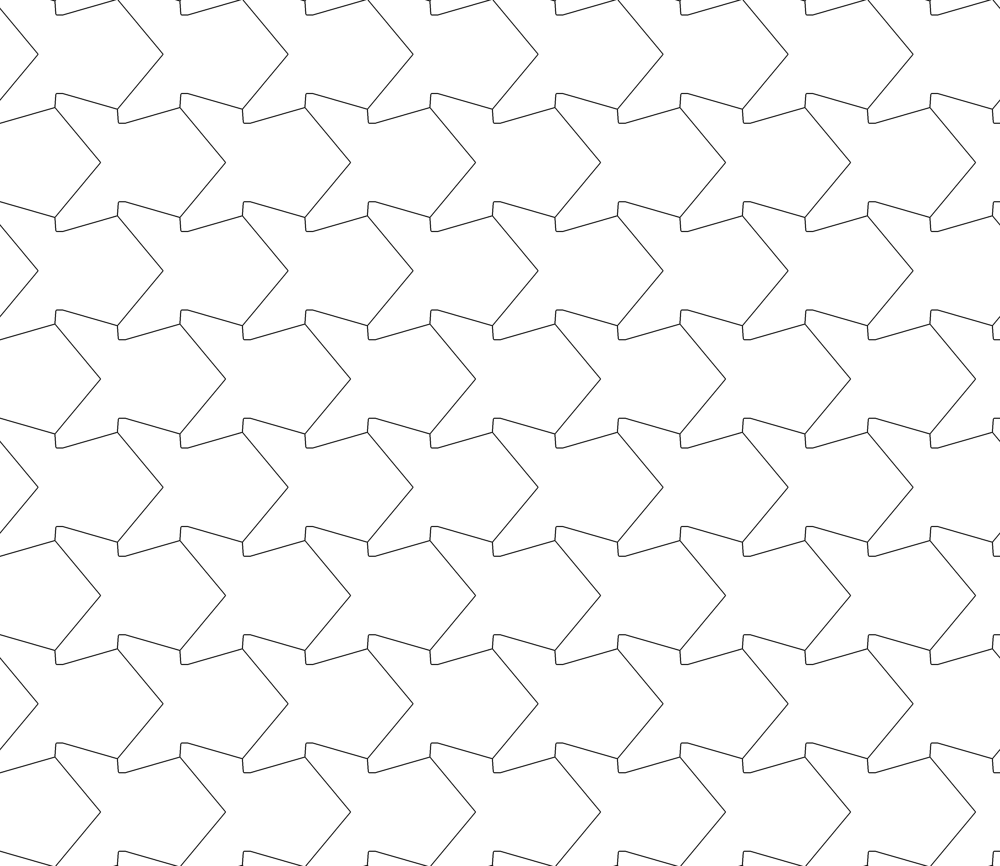

<meta charset="UTF-8">

# StarShaped2d

Code of our paper:

> [Star-Shaped Metrics for Mechanical Metamaterial Design][1]<br>
> Jonàs Martínez, Mélina Skouras, Christian Schumacher, Samuel Hornus, Sylvain Lefebvre, Bernhard Thomaszewski <br>
> ACM Transactions on Graphics — Proceedings of SIGGRAPH 2019<br>
> Volume 38 Issue 6

[1]: https://hal.inria.fr/hal-02118846

Given a polygonal star-shaped distance and a periodic lattice of point sites, the program generates a PPM image containing the approximate Voronoi network (Voronoi growth model).

## Getting started


### Prerequisites

* Standard C++ library
* CMake

### Compilation

To compile type on a terminal:

```
cmake -DCMAKE_BUILD_TYPE=Release .
```

```
make
```

If everything goes well, an executable file called **starshaped2d** will be created.

## Usage

The executable has five positional parameters:

```
./starshaped2d [1] [2] [3] [4] [5]
```

\[1] Filename of the input distance polygon, containing an ordered sequence of polygon vertices (*string*).

\[2] Resolution of the unit cell grid (*integer*).

\[3] Filename of the output PPM image storing the Voronoi network (*string*).

\[4] Maximum discrete growth length, relative to the grid resolution (*integer*).

\[5] Type of lattice of points (*integer*). Three types of lattice available: diagonal (0), triangular (1), and honeycomb (2).

For instance, typing:

```
./starshaped2d polygons/fig14/triangular_oneaxisreflection_polygon.txt 1000 result.ppm 4 1
```

Will generate the image:



given by a triangular lattice of points paired with a one-axis reflective distance (along the horizontal axis).

As a illustration, the above image tiled four times gives:




## License

The code in this project is distributed under MIT license.


## Acknowledgments

This work was partly supported by ANR MuFFin (ANR-17-CE10-0002), the French PIA project ''Lorraine Université d'Excellence'' (ANR-15-IDEX-04-LUE), the Natural Sciences and Engineering Research Council of Canada (NSERC), and the Fonds de recherche du Québec nature et technologie.
